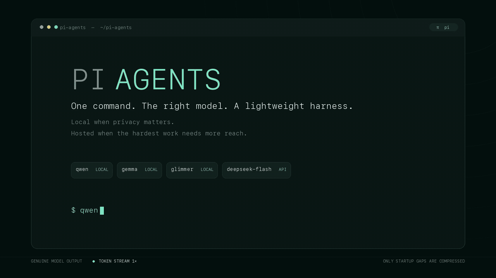

# Local and open-weight coding agents with Pi

[](./LICENSE)

This is a small, practical environment for running capable open-weight models as
coding agents. It gives each model the same lightweight terminal harness, starts
local inference only when it is needed, and reduces model selection to a command:

```bash
deepseek          # difficult, high-stakes coding and reasoning
deepseek-flash    # faster and cheaper online work
qwen              # strong general-purpose local coding agent
qwen-uncensored   # refusal-removed Qwen for controlled security research
glimmer           # local tool-driven and long-horizon agent work
gemma             # compact local reasoning and coding
nemotron          # fast local MoE coding and tool-use agent
```

All seven commands open the Pi TUI in the current directory. Arguments after the
command are passed directly to Pi.

## Demo

[](./demo/pi-agents-intro.mp4)

Qwen explains the setup, Gemma and Muse Glimmer introduce their local runtimes,
and DeepSeek V4 Flash signs off with an ASCII wave. The model output and token
timing are genuine; only the waits before each first token are shortened. Click
the animation for the [higher-quality MP4](./demo/pi-agents-intro.mp4).
Reproduction and capture details are in [`demo/README.md`](./demo/README.md).

## Quick start on Apple Silicon

This path assumes a fresh macOS installation. It installs Pi, llama.cpp, and
MLX-VLM, downloads the five local models, and creates all seven commands. The
model files use about 85 GB of disk space in total. A Mac with at least 64 GB of
unified memory is recommended for the supplied context sizes.

### 1. Clone this repository

Copy the HTTPS URL behind GitHub's **Code** button, then run:

```bash
git clone "$(pbpaste)" pi-agents
cd pi-agents
```

### 2. Install Pi and local inference servers

With [Homebrew](https://brew.sh/) already installed:

```bash
brew install node llama.cpp uv
npm install -g --ignore-scripts @earendil-works/pi-coding-agent
uv tool install mlx-vlm --with huggingface-hub --with jinja2
```

Check that the three commands are available:

```bash
pi --version
llama-server --version
mlx_vlm.server --help
```

Pi's official documentation also provides a
[curl installer](https://github.com/earendil-works/pi/blob/main/packages/coding-agent/docs/quickstart.md)
if you prefer not to install it through npm.

### 3. Install the Pi configuration and commands

For a fresh Pi installation, copy and paste:

```bash
mkdir -p "$HOME/.pi/agent" "$HOME/.local/bin" "$HOME/.local/share/pi-agents"

if [[ -e "$HOME/.pi/agent/models.json" ]]; then
  echo "Pi already has models.json; follow the merge note below."
else
  cp ./models.json "$HOME/.pi/agent/models.json"
fi

install -m 755 ./pi-model "$HOME/.local/bin/pi-model"
install -m 644 ./templates/muse-glimmer-safe.jinja \
  "$HOME/.local/share/pi-agents/muse-glimmer-safe.jinja"

commands=(qwen qwen-uncensored glimmer gemma nemotron deepseek deepseek-flash)
for command in "${commands[@]}"; do
  ln -sf "$HOME/.local/bin/pi-model" "$HOME/.local/bin/$command"
done
```

If `~/.pi/agent/models.json` already exists, do not overwrite it: merge the five
`local-*` providers from this repository's [`models.json`](./models.json) into its
`providers` object instead.

### 4. Download the local models

These commands use resumable downloads and put every GGUF where the launcher
expects it:

```bash
PI_MODEL_DIR="${XDG_DATA_HOME:-$HOME/.local/share}/pi-models"
mkdir -p "$PI_MODEL_DIR"

curl --fail --location --retry 5 --continue-at - --progress-bar \
  --output "$PI_MODEL_DIR/Qwen3.8-27B-Q4_K_M.gguf" \
  "https://huggingface.co/unsloth/Qwen3.8-27B-GGUF/resolve/main/Qwen3.8-27B-Q4_K_M.gguf?download=true"

curl --fail --location --retry 5 --continue-at - --progress-bar \
  --output "$PI_MODEL_DIR/muse-glimmer-30B-kquant-dynamic.gguf" \
  "https://huggingface.co/meta-models/Muse-Glimmer-30B-GGUF/resolve/main/muse-glimmer-30B-kquant-dynamic.gguf?download=true"

curl --fail --location --retry 5 --continue-at - --progress-bar \
  --output "$PI_MODEL_DIR/gemma-4-12b-it-qat-q4_0.gguf" \
  "https://huggingface.co/google/gemma-4-12B-it-qat-q4_0-gguf/resolve/main/gemma-4-12b-it-qat-q4_0.gguf?download=true"

curl --fail --location --retry 5 --continue-at - --progress-bar \
  --output "$PI_MODEL_DIR/NVIDIA-Nemotron-3.5-Lightning-30B-A3B-Q4_0.gguf" \
  "https://huggingface.co/ggml-org/NVIDIA-Nemotron-3.5-Lightning-30B-A3B-GGUF/resolve/main/NVIDIA-Nemotron-3.5-Lightning-30B-A3B-Q4_0.gguf?download=true"
```

The `qwen-uncensored` model requires a Hugging Face account and access approval.
Open the [Qwen 3.8 27B Uncensored MLX model card](https://huggingface.co/orcarouter/Qwen3.8-27B-Uncensored-MLX),
sign in, review the risks, and accept the access conditions. Then run the
following commands. The first command opens a browser to authorize a local read
token:

```bash
uvx --from huggingface-hub hf auth login

uvx --from huggingface-hub hf download \
  orcarouter/Qwen3.8-27B-Uncensored-MLX \
  --include "6-bit/*" \
  --local-dir "$PI_MODEL_DIR/Qwen3.8-27B-Uncensored-MLX"
```

You can download only the model you intend to use. Its corresponding alias will
work as soon as that file is present.

### 5. Add the commands and DeepSeek key to your shell

Add these lines to `~/.zshrc` on the default macOS shell, or to `~/.bashrc` or
`~/.bash_profile` when using Bash:

```bash
export PATH="$HOME/.local/bin:$PATH"
export DEEPSEEK_API_KEY="paste-your-api-key-here"
```

Create a key in the [DeepSeek API console](https://platform.deepseek.com/api_keys),
replace the placeholder, then reload the profile. For example:

```bash
source ~/.zshrc
```

On a shared machine, store the key with a credential manager instead of writing it
directly into a shell profile.

### 6. Run an agent

Move into any Git repository and invoke the model you want:

```bash
cd /path/to/project
gemma
```

The first local launch can take a little while as llama.cpp maps the model and
allocates its context. When Pi exits, the launcher stops the inference server it
started. Try the hosted route with `deepseek-flash`, or run `qwen`,
`qwen-uncensored`, `glimmer`, and `nemotron` the same way.

## Why this exists

Local agents have crossed a useful threshold. A model that fits on a developer
workstation can now reason over a repository, call shell and file tools, recover
from failed actions, and finish multi-step coding work without sending the working
context to a cloud model. They are not interchangeable with frontier hosted models,
but they are capable enough to earn distinct jobs in a normal development loop:

- sensitive repository exploration and code review on local hardware;
- repeated searches, test runs, and mechanical changes without per-token cost;
- long-running investigations where latency matters less than data locality;
- a second implementation or review path with a different model family;
- agent experiments where prompts, context, tool output, and model behavior should
  remain inspectable.

### Security work needs a dependable model path

There is another, increasingly important reason to keep these models available:
legitimate security engineering can trip the policy layer of a hosted coding
agent before it has even inspected the code. In our work, Claude Code and Fable
can become close to unusable for security fixes because benign requests are too
easily classified as unsafe. A prompt as ordinary as “look at authentication
decoding” can produce a refusal instead of an analysis.

None of the routes in this setup has shown that security-tripwire behavior in our
day-to-day use. The local Qwen, Glimmer, Gemma, and Nemotron routes do not pass
the task through a hosted provider's policy gate, while DeepSeek has been
materially less refusal-prone for this work. That does not mean the models have
no safety training or can never refuse; it means they remain available for
ordinary defensive tasks such as tracing authentication, reviewing authorization
boundaries, fixing token handling, auditing parsers, and validating a security patch.

For engineers responsible for the security of real systems, a model that will
reliably inspect and repair security-sensitive code is not a niche convenience.
Keeping local and DeepSeek routes available is becoming close to critical
infrastructure for doing the job.

The model is only half of an agent. The harness determines what context it sees,
which tools it can call, how tool results return, and how much machinery competes
for its attention. The evidence does not establish that the smallest harness always
wins, but it does establish that harness fit matters. [Harness-Bench](https://arxiv.org/abs/2605.27922)
found substantial differences across model-harness pairings in 5,194 trajectories.
[SWE-bench](https://www.swebench.com/) reports that the roughly 100-line
mini-SWE-agent can reach 74% on SWE-bench Verified, while
[SWE-Bench Mobile](https://arxiv.org/abs/2602.09540) found up to a 6x performance
gap for the same model across agents and a simple defensive-programming prompt
beating more complex prompts by 7.4%.

The practical rule is therefore to begin with a small, legible tool loop and add
scaffolding only for an observed failure mode. A larger harness can be better when
it supplies a model-specific adapter or necessary recovery behavior; complexity is
not a capability by itself.

## Why Pi

[Pi](https://github.com/earendil-works/pi) describes itself as a minimal terminal
coding harness. It is a good common shell for this experiment because it provides
the parts the models actually need without prescribing a large orchestration
system:

- an interactive terminal UI and persistent sessions;
- a small default tool surface: `read`, `bash`, `edit`, and `write`;
- tool calling and state management through `pi-agent-core`;
- one provider layer for hosted APIs and local OpenAI-compatible servers through
  `pi-ai`;
- model switching, thinking controls, print/RPC modes, skills, and extensions when
  they are genuinely useful.

This keeps the comparison understandable. The model receives a project, a prompt,
and basic tools. We can attribute a success or failure to the model and its local
configuration before reaching for planners, subagents, retrieval layers, or a
model-specific framework.

## The models and where they fit

These descriptions summarize how the model developers position their releases.
Vendor benchmarks are useful directional evidence, not independent guarantees; the
right choice still depends on the repository and task.

### DeepSeek V4 Pro — `deepseek`

DeepSeek positions V4 Pro as the higher-capability member of the V4 family, with a
1M-token context window and particular strength in agentic coding, knowledge, and
reasoning. This is the online model to reach for when correctness and persistence
matter more than price or first-token latency: security-sensitive implementation,
an unfamiliar subsystem, difficult debugging, or a change that needs to survive a
serious review. See the [DeepSeek V4 release notes](https://api-docs.deepseek.com/news/news260424/)
and [API model details](https://api-docs.deepseek.com/quick_start/pricing/).

### DeepSeek V4 Flash — `deepseek-flash`

Flash is the faster, cheaper V4 route. DeepSeek says its reasoning approaches Pro
and that it performs similarly on simpler agent tasks. Use it for rapid repository
orientation, focused fixes, test-failure triage, small features, and iterations
where several quick attempts are more valuable than one maximum-effort run.

Both DeepSeek commands use the official hosted API. Prompts and any tool output the
agent sends back to the model leave the machine.

### Qwen 3.8 27B — `qwen`

[Qwen 3.8 27B](https://huggingface.co/Qwen/Qwen3.8-27B) is a dense,
deployment-friendly local model. Its model card emphasizes coding, professional
work, research, long-horizon agent tasks, autonomous planning, and responding to
environment feedback. The full model supports vision and a native 262K context;
this setup runs its text path at 131K using a Q4_K_M GGUF.

Use Qwen as the general local coding agent: implementation, refactoring, repo-level
analysis, or a private second opinion on work first attempted with a hosted model.

### Qwen 3.8 27B Uncensored 6-bit — `qwen-uncensored`

[Qwen 3.8 27B Uncensored MLX](https://huggingface.co/orcarouter/Qwen3.8-27B-Uncensored-MLX)
is an abliterated build of Qwen 3.8 27B. Abliteration removes much of the base
model's refusal behavior. OrcaRouter provides 2-bit, 4-bit, 6-bit, and 8-bit MLX
quantizations for Apple silicon. This setup uses 6-bit weights because the model
card reports near-source numerical fidelity and a strong quality-to-size balance
at about 22 GB.

Use this route for controlled defensive security research, refusal-mechanism
evaluation, and tasks where policy false positives prevent legitimate engineering
work. Don't expose it to end users or untrusted inputs. The publisher states that
the model has no meaningful built-in guardrails and can comply with harmful,
illegal, or false requests. You remain responsible for every command that Pi runs.

### Muse Glimmer 30B — `glimmer`

[Muse Glimmer](https://huggingface.co/meta-models/Muse-Glimmer-30B) is explicitly
built for autonomous agentic work on consumer hardware. Meta highlights multi-step
reasoning, reliable schema-based tool use, failure recovery, coding, and extended
workflows. That makes it the natural local choice when the work is mostly a sequence
of actions rather than a single answer: inspect Git history, follow a change across
files, run commands, interpret failures, and keep going.

For example, if you want to understand the most recent 25 commits, run `glimmer`
and ask it to inspect the log, group the changes by intent, and trace the important
ones into the current code.

### Gemma 4 12B — `gemma`

[Gemma 4 12B](https://huggingface.co/google/gemma-4-12B-it) is the smallest model
in this setup. Google describes it as a multimodal reasoner with native function
calling, coding support, and a 256K model context. It is a useful quick local
generalist for focused code explanation, small reviews, transformations, and
bounded implementation tasks.

The downloaded Gemma model is multimodal, but this Pi route currently exposes its
text path only and uses a 65K context. Adding image/audio support would require the
matching projector and a multimodal request path; the alias should not be treated
as visually enabled today.

### Nemotron 3.5 Lightning 30B-A3B — `nemotron`

[NVIDIA Nemotron 3.5 Lightning](https://huggingface.co/nvidia/NVIDIA-Nemotron-3.5-Lightning-30B-A3B-BF16)
is a 30B-parameter mixture-of-experts model that activates about 3B parameters per
token. NVIDIA positions its hybrid Mamba-2, attention, and MoE architecture for
reasoning, coding, long-context work, tool use, and agentic systems. It is the
fast local choice when the task needs a capable action loop without paying the
compute cost of a dense 30B model on every token.

This setup uses ggml-org's Q4_0 GGUF, runs its text path at a practical 131K
context, and exposes the model's supported thinking switch as Pi's `off` and
`medium` settings. Use it for local code navigation, iterative tool-driven fixes,
and private agent work where speed matters.

## Choosing a command

| If you need to… | Start with | Why |
| --- | --- | --- |
| Implement or review a security-sensitive feature | `deepseek` | Highest-capability online reasoning route in this setup |
| Fix a contained bug or triage failing tests quickly | `deepseek-flash` | Fast, economical agent loop |
| Work on private code without sending it to a hosted model | `qwen` | Strong general local coding model |
| Run controlled defensive research without model-level refusal behavior | `qwen-uncensored` | Abliterated Qwen with 6-bit MLX weights |
| Analyze 25 commits and trace their effects through the repo | `glimmer` | Optimized for sequential tool use and recovery |
| Explain or edit a small, well-bounded area locally | `gemma` | Fastest and smallest local generalist here |
| Run a fast private coding or tool-use loop locally | `nemotron` | MoE activates about 3B of 30B parameters per token |
| Compare independent approaches | Run `qwen`, then `deepseek` | Different model families and local/hosted boundaries |

These are starting points, not hard routing rules. If a model repeatedly fails to
use a tool correctly, loses the task across turns, or cannot close the verification
loop, switch models rather than adding prompt scaffolding indefinitely.

## How the setup works

This configuration targets Pi 0.84.2 and uses its coding-agent, agent-core, AI,
and TUI packages. [`models.json`](./models.json) registers the local
OpenAI-compatible providers in Pi's standard model configuration:

```text
~/.pi/agent/models.json
```

All aliases route through [`pi-model`](./pi-model):

```text
qwen            -> pi-model
qwen-uncensored -> pi-model
glimmer         -> pi-model
gemma           -> pi-model
nemotron        -> pi-model
deepseek        -> pi-model
deepseek-flash  -> pi-model
```

The local models use Metal inference servers and fixed loopback ports. The
following table shows each route:

| Command | Model file | Provider | Port | Pi context |
| --- | --- | --- | ---: | ---: |
| `qwen` | `Qwen3.8-27B-Q4_K_M.gguf` | `local-qwen` | 18181 | 131,072 |
| `qwen-uncensored` | `Qwen3.8-27B-Uncensored-MLX/6-bit` | `local-qwen-uncensored` | 18185 | 131,072 |
| `glimmer` | `muse-glimmer-30B-kquant-dynamic.gguf` | `local-glimmer` | 18182 | 65,536 |
| `gemma` | `gemma-4-12b-it-qat-q4_0.gguf` | `local-gemma` | 18183 | 65,536 |
| `nemotron` | `NVIDIA-Nemotron-3.5-Lightning-30B-A3B-Q4_0.gguf` | `local-nemotron` | 18184 | 131,072 |

By default, the launcher discovers `pi`, `llama-server`, and `mlx_vlm.server` on
`PATH`. It reads local models from
`${XDG_DATA_HOME:-$HOME/.local/share}/pi-models`. Advanced users can override the
defaults with `PI_BIN`, `LLAMA_SERVER_BIN`, `MLX_VLM_SERVER_BIN`, `PI_MODEL_DIR`,
or the individual `QWEN_MODEL_PATH`, `QWEN_UNCENSORED_MODEL_PATH`,
`GLIMMER_MODEL_PATH`, `GEMMA_MODEL_PATH`, and `NEMOTRON_MODEL_PATH` variables.
A standard installation does not need any of them.

### Local model lifecycle

Running `qwen`, `qwen-uncensored`, `glimmer`, `gemma`, or `nemotron`:

1. checks that the required model files and inference server exist;
2. checks whether the correct model is already listening on its assigned port;
3. otherwise starts a loopback-only inference server with Metal GPU offload;
4. waits for the OpenAI-compatible endpoint to become ready;
5. starts Pi with the matching provider and model selected;
6. stops the server it owns when Pi exits.

If the correct server was already running, the launcher reuses it and does not stop
it. Logs are written to `${TMPDIR:-/tmp}/pi-local-models`.

The GGUF routes use llama.cpp. The `qwen-uncensored` route uses MLX-VLM with an
8-bit KV cache, one concurrent sequence, and a 131,072-token cache limit. The
launcher creates a temporary model overlay that disables completed-turn reasoning
replay without modifying the downloaded model, binds both servers to `127.0.0.1`,
and stops the process that it starts.

All five local aliases start with Pi's broad skill discovery disabled. When
present, only `agent-browser`, `chrome-cdp`, and `frontend-design` are added to
their sessions. This keeps unrelated skill descriptions out of the local models'
resident context. Add a one-off skill with, for example,
`qwen --skill /path/to/skill`, or edit `run_local_agent` in the launcher to change
the persistent allowlist.

Glimmer uses the checked-in [`muse-glimmer-safe.jinja`](./templates/muse-glimmer-safe.jinja)
adapter. Its upstream chat template replays every prior `reasoning_content` block
even when `preserve_thinking=false`; llama.cpp's `--no-reasoning-preserve` flag
does not override that template. The adapter keeps reasoning inside the current
tool-call chain, where the model needs it, and removes it after a newer user turn.

### Reasoning controls

Pi exposes a common set of thinking labels, but the models do not implement the
same control surface. [`models.json`](./models.json) maps each Pi label to a value
the selected model actually supports:

| Pi label | DeepSeek V4 Flash/Pro | Qwen 3.8 routes | Muse Glimmer | Gemma 4 | Nemotron 3.5 |
| --- | --- | --- | --- | --- | --- |
| `off` | disabled | disabled | unavailable | disabled | disabled |
| `minimal` | `low` | `low` | `low` | unavailable | unavailable |
| `low` | `low` | `low` | `low` | unavailable | unavailable |
| `medium` | `high` | `medium` | `medium` | enabled | enabled |
| `high` | `high` | `xhigh` | `high` | unavailable | unavailable |
| `xhigh` | `high` | `xhigh` | `xhigh` | unavailable | unavailable |
| `max` | `max` | `xhigh` | `xhigh` | unavailable | unavailable |

The Pi footer shows the Pi-side label. For example, `deepseek --thinking medium`
displays `medium` while sending DeepSeek's documented `high` effort, and
`qwen --thinking high` sends Qwen's `xhigh`. Glimmer does not have a reliable
non-reasoning mode, so `off` is deliberately hidden. Gemma exposes only a switch,
so Pi offers `off` and `medium` (enabled) instead of pretending that several
effort levels are distinct. Nemotron likewise exposes a thinking switch, so it
offers only `off` and `medium`. These mappings follow the model developers'
[DeepSeek](https://api-docs.deepseek.com/guides/thinking_mode/),
[Qwen](https://huggingface.co/Qwen/Qwen3.8-27B),
[Glimmer](https://huggingface.co/meta-models/Muse-Glimmer-30B),
[Gemma](https://huggingface.co/google/gemma-4-12B-it), and
[Nemotron](https://huggingface.co/nvidia/NVIDIA-Nemotron-3.5-Lightning-30B-A3B-BF16)
guidance.

The local routes do not replay hidden reasoning across completed user turns:

- Qwen receives `preserve_thinking=false` through its chat-template arguments.
- Qwen Uncensored uses MLX-VLM's top-level thinking control. Its upstream template
  preserves earlier reasoning by default, so the launcher changes that default in
  a temporary overlay. It retains only reasoning from the current tool-call chain.
- Gemma's canonical template strips old thoughts; the setting is also explicit.
- Nemotron's canonical template receives `truncate_history_thinking=true`, which
  strips older thoughts while retaining the current tool-call chain. It also gets
  NVIDIA's recommended `force_nonempty_content=true` agent setting.
- Glimmer uses the adapter above because its upstream template does not honor the
  flag. Current-turn reasoning is still preserved across tool calls.

Visible assistant answers, tool calls, and tool results remain in conversation
history. Only the hidden reasoning trace is removed when the next user turn begins.
This prevents a mistaken intermediate thought—such as a hallucinated model
identity—from becoming persistent context.

DeepSeek is the deliberate exception. Its hosted API requires
`reasoning_content` to be returned with assistant messages involved in a tool-call
chain, or a later request can fail with HTTP 400. Pi's built-in DeepSeek adapter
preserves that field according to the API contract. It remains an assistant-message
field, not an injected system prompt; DeepSeek ignores reasoning from ordinary
completed turns.

The local sampling defaults also follow the model cards: both Qwen routes use
`temperature=1.0`, `top_p=0.95`, and `top_k=20`; Glimmer and Gemma use
`temperature=1.0`, `top_p=0.95`, and `top_k=64`; Nemotron uses its documented
`temperature=1.0` and `top_p=0.95`. Qwen's alias is optimized for
normal thinking-enabled agent use. Its model card recommends different sampling
for non-thinking chat, which this static Pi model entry does not switch dynamically.

### Verify the active model

Do not use a model's prose claim about its own identity as routing evidence. Check
the model id in Pi's footer, or ask the running agent to execute:

```bash
env | grep -E '^PI_(PROVIDER|MODEL|REASONING_LEVEL)=' | sort
```

For a normal Qwen launch, the authoritative runtime values include:

```text
PI_MODEL=qwen3.8-27b
PI_PROVIDER=local-qwen
```

The other aliases report `local-qwen-uncensored` /
`qwen3.8-27b-uncensored-6bit`, `local-glimmer` / `muse-glimmer-30b`, `local-gemma` /
`gemma-4-12b`, `local-nemotron` / `nemotron-3.5-lightning-30b-a3b`, or `deepseek`
with the selected V4 model. This setup injects no
Claude or Opus identity statement. If an older saved conversation already contains
a false visible identity claim, start a fresh session after updating; replay
controls cannot erase text that is intentionally part of a resumed conversation.

### DeepSeek authentication

The online aliases read `DEEPSEEK_API_KEY` from the process environment:

```bash
export DEEPSEEK_API_KEY="your-api-key"
```

Persist the key with a shell credential helper, password manager, or other secret
manager. Do not put it in `models.json` or commit it to the repository.

## Using it

Open an interactive agent in any repository:

```bash
cd /path/to/project
qwen
```

Then give it a concrete objective and completion boundary:

```text
Trace the authentication flow, implement the missing token rotation check,
run the focused tests, and report anything you could not verify.
```

Run a one-off task without opening the TUI:

```bash
glimmer -p \
  "Inspect the latest 25 commits. Group them by intent, explain the most important behavioral changes, and identify any unfinished follow-up."
```

Select a thinking level:

```bash
deepseek --thinking max
deepseek-flash --thinking low -p "Diagnose this failing test: ..."
qwen --thinking high             # maps to Qwen xhigh
qwen-uncensored --thinking high  # maps to Qwen xhigh
glimmer --thinking xhigh
gemma --thinking medium          # Gemma thinking on
gemma --thinking off             # Gemma thinking off
nemotron --thinking medium       # Nemotron thinking on
nemotron --thinking off          # Nemotron thinking off
```

Pass any other Pi option through normally:

```bash
qwen --no-session
qwen-uncensored --tools read,bash -p "Review this parser for unsafe input handling."
gemma --tools read,bash -p "Explain why this build fails without editing files."
pi --list-models
pi --help
```

## Security boundary

Local inference keeps model prompts and responses on the workstation, but it does
not make the agent sandboxed. Pi intentionally runs with the permissions of the
user who launched it. A local model with `bash`, `edit`, and `write` can read or
change anything that user can access. Review commands and use a container or VM
when the repository or task requires a stronger boundary. Pi documents this
explicitly in its [containerization guide](https://github.com/earendil-works/pi/blob/main/packages/coding-agent/docs/containerization.md).

The hosted DeepSeek aliases add a second boundary: conversation content and tool
results selected by the agent are sent to DeepSeek. Prefer a local alias for private
material that must not leave the machine.

The `qwen-uncensored` route removes an additional safety boundary. The model card
states that abliteration substantially removes safety alignment and refusal
behavior. Run it only in a controlled development environment. Don't give it
credentials, production access, or broader tools than the task requires.

## Why CUA VM acceleration is not enabled

The [CUA Metal capability shim](https://github.com/trycua/cua/blob/main/blog/gpu-passthrough-macos-vms.md)
can make llama.cpp much faster inside a constrained macOS VM. Its published result
recovers performance toward bare-metal Metal; it does not make the VM faster than
running the model directly on the host. The technique is also experimental,
version-sensitive, and was validated on a different Apple Silicon generation.

These launchers therefore use the host's Apple GPU directly. CUA remains interesting
when macOS-guest isolation is required, but it is not an acceleration layer for a
host-native Metal path.

## References

- [Pi documentation](https://github.com/earendil-works/pi/blob/main/packages/coding-agent/docs/index.md)
- [Harness-Bench](https://arxiv.org/abs/2605.27922)
- [SWE-bench and mini-SWE-agent](https://www.swebench.com/)
- [SWE-Bench Mobile](https://arxiv.org/abs/2602.09540)
- [DeepSeek V4 release](https://api-docs.deepseek.com/news/news260424/)
- [DeepSeek API models and pricing](https://api-docs.deepseek.com/quick_start/pricing/)
- [Qwen 3.8 27B model card](https://huggingface.co/Qwen/Qwen3.8-27B)
- [Qwen 3.8 27B Uncensored MLX model card](https://huggingface.co/orcarouter/Qwen3.8-27B-Uncensored-MLX)
- [MLX-VLM server](https://github.com/Blaizzy/mlx-vlm#server-fastapi)
- [Muse Glimmer 30B model card](https://huggingface.co/meta-models/Muse-Glimmer-30B)
- [Gemma 4 12B model card](https://huggingface.co/google/gemma-4-12B-it)
- [NVIDIA Nemotron 3.5 Lightning 30B-A3B model card](https://huggingface.co/nvidia/NVIDIA-Nemotron-3.5-Lightning-30B-A3B-BF16)
- [ggml-org Nemotron 3.5 Lightning GGUF](https://huggingface.co/ggml-org/NVIDIA-Nemotron-3.5-Lightning-30B-A3B-GGUF)
- [CUA macOS VM Metal results](https://github.com/trycua/cua/blob/main/blog/gpu-passthrough-macos-vms.md)
